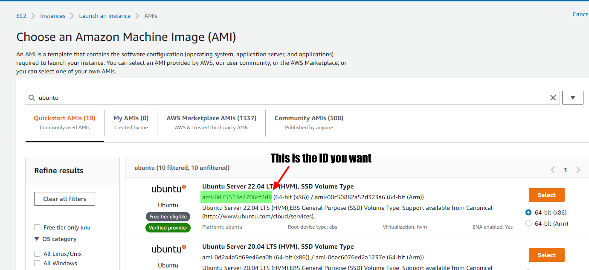
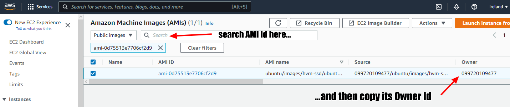

# AWS Dev Environment

Why go bankrupt just to get a decent development environment? You don't need to pay for the latest MacBook Pro to get the RAM and CPU needed to run a tensorflow model. All you need is an internet connection and an AWS account.

This is a guide to setting up a development environment on AWS. AWS offers free computing resources for an year, and about $5/month after that.

This will deploy an AWS EC2 instance with an Ubuntu AMI and Docker ready to go.

## Instructions

1. Create an AWS account
2. Create an IAM user
   1. Choose "Programmatic" access type
   2. Click "Attach existing policy directly" and then choose "AdministrationAccess"
   3. Add any tags you may want
   4. Save the resulting Access Key ID and Secret Access Key
3. Install either the AWS VSCode extension or the AWS CLI. You will be required to add the AWS credentials you have just created.
4. Install terraform and the AWS provider
5. We'll be installing a simple Ubuntu image. If you want to change that image, you'll need to change the AMI owner id and the AMI name settings. Read how at ["Setting up the AMI"](#setting-up-the-ami).
6. Set the local environment variables by copying `example.tfvars` to a `terraform.tfvars` file.
7. Generate an SSH keypair with the `ssh-keygen -t ed25519` command. We will be calling it `aws_dev_environ`.
8. Deploy your AWS Dev environment with the following commands:
   1. `terraform init`
   2. `terraform plan`
   3. `terraform apply`
9. SSH into your newly created instance:
   1. Get the public ID address: `terraform state show aws_instance-dev_node | grep public_ip`
   2. SSH into the instance: `ssh -i <path_to_public_ssh_key> ubuntu@<public_ip>`

We've also added a local provisioner to the infrastructure configuration. If it runs correctly, you should be able to connect to the instance by installing the "Remote-SSH" plugin and then selecting the "Connect to Host" option.

## Terraform commands

Basic command cycle is:

`terraform init` -> `terraform plan` -> `terraform apply`

- **terraform fmt** - Formats the `.tf` files.
- **terraform show** - Shows the entire Terraform state or plan file in a human-readable
  form.
- **terraform state list** - List resources in the state.
- **terraform state show RESOURCE_NAME** - Show a resource in the state.
- **terraform destroy** - Destroy Terraform-managed infrastructure.
- **terraform plan -destroy** - Shows you what the destroy changes would be, without doing them.
- **terraform console** - Opens an interactive console for experimenting with Terraform interpolations.
- **terraform import** - Import existing infrastructure into Terraform.
- **terraform validate** - Validates the Terraform files.
- **terraform apply -auto-approve** - Apply changes without confirmation.
- **terraform plan -out=NAME** - Generate and save a plan file.
- **terraform apply NAME** - Apply a saved plan file.

## Infrastructure

### VPCs and Subnets

#### VPC

A VPC is essentially just a virtual network. It is isolated from resources located on other VPCs that you might create. When you create a VPC, you create it within a specific region. The VPC can service all of the availability zones within the region, but it cannot extend to other regions.

When you create a VPC, AWS asks you to associate a CIDR block with the VPC. CIDR is an acronym that stands for Classless Inter-Domain Routing. In simpler terms, a CIDR block is an IP address range. A VPC can accommodate two CIDR blocks, one for IPv4 and another for IPv6, but for the sake of simplicity we are going to talk about IPv4.

#### Subnets

A subnet is a range of IP addresses in your VPC. You can attach AWS resources, such as EC2 instances and RDS DB instances, to subnets. You can create subnets to group instances together according to your security and operational needs.

When you create a CIDR block, you must enter it as an IP address range. In the case of an IPv4 CIDR, this means entering a network prefix and a subnet mask. The subnet mask determines how many IP addresses can be created from the CIDR block. Amazon requires that a CIDR block include a subnet mask ranging from 16 to 28. The two most commonly used subnet sizes are 16 bits and 24 bits.

If you were to create a CIDR block with a 16-bit subnet, then the network portion of the IP address would contain two eight-bit numbers, followed by two zeros, each separated by periods. Here is an example of a CIDR block with a 16-bit subnet: **10.10.**0.0/16. This block would allow for the creation of up to 65,536 IP addresses. Each address would start with 10.10, but you can enter any value between 0 and 255 into the last two positions.

A CIDR block with a 24-bit address would contain three eight-bit numbers, followed by a single 0. Here is an example of what such a block would look like: **10.10.10**.0/24. This block could accommodate up to 256 IP addresses. The first three octets (10.10.10) would be common to each address, but the last digit can be populated with a number ranging between 0 and 255.

The key to understanding the way that subnetting works in AWS is to keep in mind that when you create a CIDR block, you are not actually creating any subnets. Subnets have to be created separately and must fall within the range of the CIDR block. It's perfectly acceptable to create a single subnet that consumes the entire CIDR block (just use the same range when defining the VPC), but you also have the option of dividing the block into multiple subnets as is often done with very large CIDR blocks.

### Internet Getaway

A gateway is what allows a VPC to communicate with the internet.

### Route tables

Table tables allow to route traffic from the subnet to our internet getaway. It contains a set of rules, called routes, that determine where network traffic from your subnet or gateway is directed.

Each subnet in your VPC must be associated with a route table. You can explicitly associate a subnet with a particular route table. A subnet can only be associated with one route table at a time, but you can associate multiple subnets with the same subnet route table.

### Amazon Machine Images (AMIs)

AMIs are a collection of a supported and maintained image provided by AWS that provides the information required to launch an instance. We will need to create an AMI for our EC2 instance.

#### Setting up the AMI

Unfortunately, Terraform requests the Owner ID of the AMI we choose, and there is no way to get this automatically.

To get an Owner ID:

1. Go to the AWS console,
2. Go to EC2 instances and click "Launch Instances" (don't worry, we won't be completing this yet),
3. There, the first option will be to select or create a new AMI. Choose to user a public one.
4. When you decide on the AMI you want, copy its ID:

5. Go the the search bar and search "AMI" to find the "Amazon Machine Images (AMIs)" page. In there search the public images for the AMI Id you've just copied.
6. Finally, copy the Owner Id from the AMI you've found. Keep this page open, as you'll be using it again.

7. Paste the Owner ID in `terraform.tfvars` using quotes at the `aim_owner_id` attribute.
8. Then copy the server name. Paste it at the `terraform.tfvars` as the `aim_name` attribute. As we'll be using the most recent version of that image, you can replace the number at the end for `*`.

### Key Pairs

Key pairs are used to authenticate an EC2 instance. We will be using one so that we can SSH into the instance.
